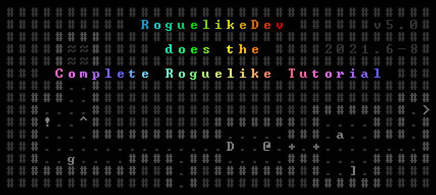

# Another Roguelike Game

Participating in r/roguelikedev's tutorial series: [Link](https://www.reddit.com/r/roguelikedev/comments/oa2g5r/roguelikedev_does_the_complete_roguelike_tutorial/)

I am using [RLTiles](https://github.com/statico/rltiles) as the spritesheet.

No library will be used, as I want to learn things from scratch.